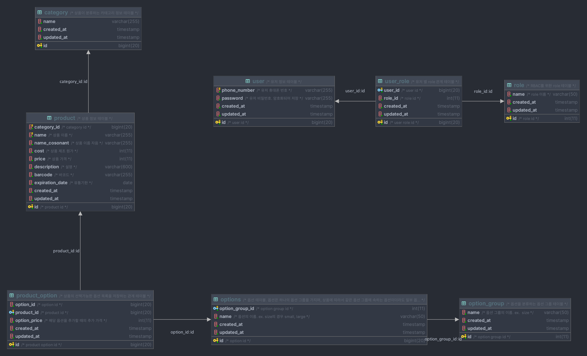

# 카페 사장님을 위한 카페 관리 application

## 기능

### 회원 API

- 회원 가입
    - `POST /users/sign-up`

### 인증 API

- 로그인
    - `POST /auth/login`
- 토큰 갱신
    - `POST /auth/login/refresh`

### 상품 API

- 상품 정보 조회
    - `GET /products`
- 상품 정보 단건 조회
    - `GET /products/{productId}`
- 상품 등록
    - `POST /products`
- 상품 정보 수정 (부분 수정)
    - `PATCH /products/{productId}`
- 상품 정보 삭제
    - `DELETE /products/{productId}`

자세한 api 명세(OAS 3.0)는 application 실행 후 `http://localhost:8080/` 에서 확인할 수 있습니다.

## DB 설계

mysql을 사용하여 다음과 같이 설계하였습니다.

DDL은 `cafe-storage/src/main/resources/db/migration/*.sql` 경로에서 확인할 수 있습니다.
flyway를 사용하여 migration을 처리하였으며, gradle task를 따로 실행하여 migration을 수행할 수 있습니다.

## 모듈

- `cafe-manager`
    - project의 root module
    - 하위 module들을 포함합니다.
- `cafe-api`
    - runnable한 module로써 api를 제공합니다.
    - 다른 module에 대한 의존성은 다음과 같습니다.
        - `cafe-domain`: *implementation*
        - `cafe-storage`: *runtimeOnly*
- `cafe-domain`
    - domain을 정의합니다.
- `cafe-storage`
    - database와의 연동을 처리합니다.
    - `cafe-domain`을 *compileOnly*로 의존합니다.

## 사용 기술

- **build tool**
    - gradle 7.6.1
- **language**
    - kotlin 1.6.21
- **framework & library**
    - spring boot 2.7.11
    - spring mvc
    - spring data jpa
    - querydsl-jpa
- **database**
    - mysql 5.7
    - *(TBD)* redis(cache)
- **database migration tool**
    - flyway 7.15.0

## 실행 방법

- database 실행(docker-compose)
    - `docker-compose -f ./docker-compose/docker-compose.yaml up -d`
- flyway migration
    - `./gradlew :cafe-storage:flywayMigrate`
- application 실행
    - `./gradlew :cafe-api:bootRun`
